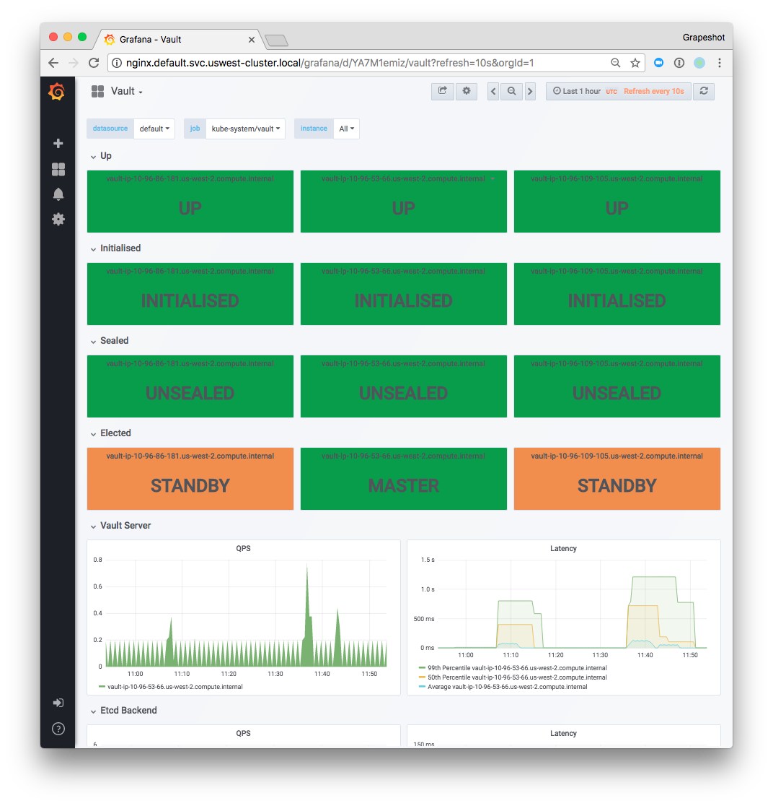

# Vault Exporter

## ⚠ NOT MAINTAINED ⚠

This is a MIRROR of a deleted github repository under: https://github.com/grapeshot/vault_exporter

Recent versions of Hashicorp Vault have added native support for the majority of what was prevviously provided by this exporter. As such, this shouldn't be used anymore.

   * Hashicorp Vault Telemetry (Prometheus): https://www.vaultproject.io/docs/configuration/telemetry#prometheus

--------------------------------

Export [Hashicorp Vault](https://github.com/hashicorp/vault) health to [Prometheus](https://github.com/prometheus/prometheus).

## Exported Metrics

| Metric | Meaning | Labels |
| ------ | ------- | ------ |
| vault_up | Was the last query of Vault successful, | |
| vault_initialized | Is the Vault initialised (according to this node). | |
| vault_sealed | Is the Vault node sealed. | |
| vault_standby | Is this Vault node in standby. | |
| vault_replication_dr_primary | Is this Vault node a primary disaster recovery replica. | |
| vault_replication_dr_secondary | Is this Vault node a secondary disaster recovery replica. | |
| vault_replication_performance_primary | Is this Vault node a primary performance replica. | |
| vault_replication_performance_secondary | Is this Vault node a secondary performance replica. | |
| vault_info | Various info about the Vault node. | version, cluster_name, cluster_id |

## Dashboards and alerts



Example dashboards and alerts for this exporter are included in the
mixin directory, in the form of a jsonnet monitoring mixin.  They
are designed to be combined with the [prometheus-ksonnet](https://github.com/kausalco/public/tree/master/prometheus-ksonnet) package.

To install this mixin, use [ksonnet](https://ksonnet.io/):

```sh
$ ks registry add vault_exporter https://github.com/lrstanl/vault-exporter
$ ks pkg install vault_exporter/vault-mixin
```

Then to use, in your `main.jsonnet` file:

```js
local prometheus = (import "prometheus-ksonnet/prometheus-ksonnet.libsonnet");
local vault = (import "vault-mixin/mixin.libsonnet");

prometheus + vault {
  jobs+: {
    vault: "<my vault namespace>/<my value name label>",
  },
}
```

## Flags

```bash
$ ./vault_exporter -h
usage: vault_exporter [<flags>]

Flags:
  -h, --help              Show context-sensitive help (also try --help-long and --help-man).
      --web.listen-address=":9410"
                          Address to listen on for web interface and telemetry.
      --web.telemetry-path="/metrics"
                          Path under which to expose metrics.
      --vault-tls-cacert=VAULT-TLS-CACERT
                          The path to a PEM-encoded CA cert file to use to verify the Vault server SSL certificate.
      --vault-tls-client-cert=VAULT-TLS-CLIENT-CERT
                          The path to the certificate for Vault communication.
      --vault-tls-client-key=VAULT-TLS-CLIENT-KEY
                          The path to the private key for Vault communication.
      --insecure-ssl      Set SSL to ignore certificate validation.
      --log.level="info"  Only log messages with the given severity or above. Valid levels: [debug, info, warn, error, fatal]
      --log.format="logger:stderr"
                          Set the log target and format. Example: "logger:syslog?appname=bob&local=7" or "logger:stdout?json=true"
      --version           Show application version.
```

## Environment variables

Note that environment variables can be overwritten by flags.

* `VAULT_ADDR` – Sets the address of Vault in the client, The format of address should be "<Scheme>://<Host>:<Port>" (defaults to `https://127.0.0.1:8200`)
* `VAULT_CACERT` – CACert is the path to a PEM-encoded CA cert file to use to verify the Vault server SSL certificate (defaults to empty)
* `VAULT_CAPATH` – CAPath is the path to a directory of PEM-encoded CA cert files to verify the Vault server SSL certificate (defaults to empty)
* `VAULT_CLIENT_CERT` – ClientCert is the path to the certificate for Vault communication (defaults to empty)
* `VAULT_CLIENT_KEY` – ClientKey is the path to the private key for Vault communication (defaults to empty)
* `VAULT_CLIENT_TIMEOUT` – Timeout is for setting custom timeout parameter in the Http-client (defaults to `0`)
* `VAULT_SKIP_VERIFY` – SkipVerify enables or disables SSL verification (defaults to `false`)
* `VAULT_TLS_SERVER_NAME` – TLSServerName, if set, is used to set the SNI host when connecting via TLS (defaults to empty)
* `VAULT_MAX_RETRIES` – MaxRetries controls the maximum number of times to retry when a 5xx error occurs (defaults to `0`)
* `VAULT_TOKEN` – Token is the access token used by client
